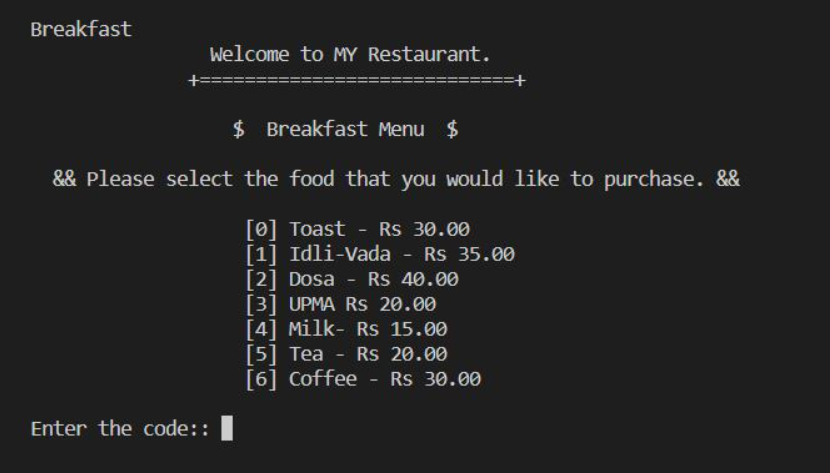
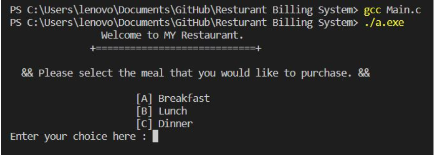

# RESTURANT_BILLING_SYSTEM
The Restaurant Billing System is an efficient and user-friendly software designed to streamline billing processes in restaurants. It facilitates order management, calculates total bills, applies taxes and discounts, and ensuring accuracy and enhancing the dining experience for customers while simplifying financial management for restaurant staff.
# Resturant Billing System

## STEP-1

Select the Meal Menu :-

## STEP-2

Select the item from Menu :-

## STEP-3

Select the quantity of item :-

.

<b>© Created by Anant Samrat</b></p?
